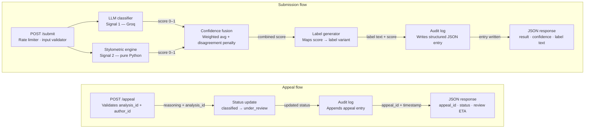

# Project 4 Planning: Provenance Guard

## 1. System Overview

Provenance Guard is a pluggable backend service that accepts text-based creative content, runs it through a two-signal detection pipeline, returns a structured attribution result with a calibrated confidence score, surfaces a plain-language transparency label, and supports a creator appeals workflow. Every decision is written to a structured audit log.

### Architecture



**Submission flow:** A piece of text enters through POST /submit, where the rate limiter and input validator act as gatekeepers before anything expensive happens. It then fans out to both signals in parallel — the LLM classifier returns a holistic semantic score and the stylometric engine returns a structural score, each as a 0–1 float. The confidence fusion layer combines them (with a disagreement penalty when the signals diverge), and that combined score is passed to the label generator, which selects the right variant and copy. Both the label and the decision are written to the audit log unconditionally before the structured JSON response goes back to the caller.

**Appeal flow:** Much simpler — a POST /appeal carrying the analysis_id and the creator's reasoning is validated, flips the content status from classified to under_review, appends an appeal entry to the audit log, and returns an appeal_id with a review ETA. The original classification is preserved throughout; nothing is overwritten.

---

## 2. Detection Signals

### Signal A — LLM Semantic Classifier

**What it measures:**  
Holistic semantic and stylistic coherence. The full text is sent to a Groq-hosted LLM (`llama-3.3-70b-versatile`) with a structured prompt asking it to assess whether the writing exhibits characteristics of human authorship or AI generation. The model returns a verdict and a 0–1 confidence float derived from its reasoning.

**Why this property differs between human and AI text:**  
Human writing reflects a consciousness navigating uncertainty — it contains unexpected metaphors, structural risk-taking, self-contradiction, and tonal variation. LLM output, even when high-quality, tends toward completeness and smooth resolution of tension. It rarely leaves a sentence unfinished in spirit. A model is particularly well-positioned to detect this because it understands its own output patterns from the inside.

**Output shape:**

```json
{
  "signal": "llm_classifier",
  "verdict": "ai",
  "raw_score": 0.84,
  "reasoning_excerpt": "The text exhibits highly uniform sentence cadence and lacks idiosyncratic phrasing..."
}
```

`raw_score` is 0.0 (confident human) → 1.0 (confident AI). The LLM is prompted to produce this float explicitly; it is not derived post-hoc from token probabilities.

**Blind spots:**

- Adversarial prompting: an LLM told to "write like a human" scores better than a neutral LLM
- Cultural/linguistic bias: formal writing from non-native English speakers can appear "AI-like"
- Non-determinism: the same text may score ±0.05 across calls
- Very short texts (< 100 words): insufficient context for reliable holistic judgment

---

### Signal B — Stylometric Heuristic Engine

**What it measures:**  
Four structural-statistical properties computed entirely in Python, with no model dependency:

| Sub-signal                     | What it captures                                                     | AI tendency                                                                    |
| ------------------------------ | -------------------------------------------------------------------- | ------------------------------------------------------------------------------ |
| **Sentence Length Variance**   | Standard deviation of per-sentence word counts                       | LLM output clusters near a comfortable mean; σ is low                          |
| **Type-Token Ratio (TTR)**     | Unique words ÷ total words                                           | LLM vocab is broad but not weird; TTR is middling-high but lacks outlier words |
| **Exotic Punctuation Density** | Em-dashes, ellipses, semicolons, parentheticals per 100 words        | Humans punctuate for rhythm; LLMs default to commas and periods                |
| **Burstiness Index**           | Whether sentence lengths swing or cluster (coefficient of variation) | Human prose bursts: long when exploring, short for impact                      |

Each sub-signal is normalised to [0, 1] using pre-computed reference ranges derived from a held-out calibration corpus. The four sub-scores are averaged into a single `stylometric_score`.

**Why this property differs between human and AI text:**  
LLMs are trained on human feedback that rewards readability and consistency. That training pressure produces statistical regularity — sentence lengths cluster, punctuation is standard, vocabulary is diverse but not idiosyncratic. Human writers produce regularity that reflects thought, not optimization: they repeat a word when they mean it, use a dash when a comma feels wrong, write a three-word sentence after a 40-word one.

**Output shape:**

```json
{
  "signal": "stylometric",
  "verdict": "ai",
  "raw_score": 0.71,
  "sub_scores": {
    "sentence_length_variance": 0.68,
    "type_token_ratio": 0.55,
    "exotic_punctuation_density": 0.82,
    "burstiness_index": 0.78
  }
}
```

`raw_score` is 0.0 (confident human) → 1.0 (confident AI).

**Blind spots:**

- Short texts (< 150 words): statistical measures become unreliable with small n
- Minimalist/simple prose styles: haiku, flash fiction, plain-language writing will score as AI-like even if human-authored
- Professionally edited text: journalism and technical writing is edited toward uniformity
- This signal captures nothing about meaning — a well-prompted LLM told to vary sentence lengths will defeat it

---

## 3. Confidence Fusion & Uncertainty Representation

### Fusion Method

The two raw scores are combined using a **disagreement-penalised weighted average**:

```python
WEIGHT_LLM = 0.60
WEIGHT_STYLO = 0.40

def fuse(llm_score: float, stylo_score: float) -> float:
    weighted_avg = (WEIGHT_LLM * llm_score) + (WEIGHT_STYLO * stylo_score)

    # Disagreement penalty: pull score toward 0.5 when signals conflict
    disagreement = abs(llm_score - stylo_score)
    penalty = disagreement * 0.15  # max pull of 0.15 toward centre

    if weighted_avg > 0.5:
        return weighted_avg - penalty
    else:
        return weighted_avg + penalty
```

**Why this matters:** A naive average of 0.8 (AI) and 0.2 (human) produces 0.5, which _looks_ uncertain but for the wrong reason — it's hiding a real disagreement. The disagreement penalty makes that uncertainty _visible_ in the score rather than washing it out.

### Score Interpretation

| Fused Score Range | Label       | Meaning                                           |
| ----------------- | ----------- | ------------------------------------------------- |
| 0.00 – 0.30       | `human`     | Both signals lean human, or one is strongly human |
| 0.31 – 0.45       | `uncertain` | Signals conflict or both are weakly human-leaning |
| 0.46 – 0.54       | `uncertain` | True ambiguity zone — system cannot commit        |
| 0.55 – 0.69       | `uncertain` | Signals conflict or both are weakly AI-leaning    |
| 0.70 – 1.00       | `ai`        | Both signals lean AI, or one is strongly AI       |

**What a score of 0.60 means:**  
The system leans toward AI but is not confident. The weighted evidence tips AI, but either the signals disagree, one signal had low internal confidence, or the text is atypical enough that the system is genuinely unsure. The transparency label for this score explicitly communicates uncertainty — it does _not_ say "likely AI."

**What a score of 0.51 vs 0.95 means:**

- `0.51`: The system is essentially at the boundary — both variants of the label (uncertain vs. AI) are defensible. The label shown is "Authorship Unclear" with language that acknowledges the system had very little to go on.
- `0.95`: Both signals agree strongly that this is AI-generated. The label shown is "Likely AI-Generated" with high-confidence language.

These two scores produce _meaningfully different label copy_, not just different numbers.

### Calibration Approach

Raw scores from both signals are passed through a **calibration curve** fitted on a held-out test set of texts (confirmed human and confirmed AI) before fusion. The calibration step corrects for known biases — the LLM classifier tends toward overconfidence at the extremes. Post-calibration, a score of 0.7 should correspond to approximately 70% empirical accuracy on the test set.

---

## 4. Transparency Label Design

The label generator maps `(label, confidence)` pairs to one of three variants. The confidence value informs the _intensity_ of the language even within a variant.

---

### Variant 1 — High-Confidence AI

**Trigger:** `label == "ai"` AND `confidence ≥ 0.80`

**Headline:** `Likely AI-Generated`

**Body:**

> Our analysis suggests this content was probably written with AI assistance. Two independent checks — one looking at writing structure and rhythm, one assessing overall voice and coherence — both point in the same direction. This label doesn't mean the content is low quality or that the author did anything wrong. It's here so you can read with that context in mind.

**Confidence phrase appended when confidence ≥ 0.90:**

> _(High confidence)_

**Confidence phrase appended when confidence 0.80–0.89:**

> _(Moderate-high confidence)_

---

### Variant 2 — High-Confidence Human

**Trigger:** `label == "human"` AND `confidence ≤ 0.20` (i.e. fused score far from AI end)

**Headline:** `Likely Written by a Person`

**Body:**

> Our analysis suggests this content was probably written by a person without significant AI assistance. Two independent checks found writing patterns — in both structure and voice — consistent with human authorship. This is a probabilistic assessment, not a guarantee.

**Confidence phrase appended when confidence ≤ 0.10:**

> _(High confidence)_

**Confidence phrase appended when confidence 0.11–0.20:**

> _(Moderate-high confidence)_

---

### Variant 3 — Uncertain

**Trigger:** `label == "uncertain"` (fused score 0.31–0.69)

**Headline:** `Authorship Unclear`

**Body:**

> Our analysis wasn't able to reach a confident conclusion about how this content was written. The signals we use can be inconclusive on mixed or atypical content — heavily edited AI text, AI-assisted human writing, or unusually formal human prose can all look similar to our system. We're showing you this label in the spirit of transparency, not as an accusation.

**Additional note appended when signals actively disagree (disagreement > 0.30):**

> _Our two detection methods gave conflicting results for this piece, which is why we're not drawing a firm conclusion._

---

### Label Schema (typed)

```typescript
interface TransparencyLabel {
  variant: "high_confidence_ai" | "high_confidence_human" | "uncertain";
  headline: string;
  body: string;
  confidence_phrase: string | null;
  conflict_note: string | null;
  confidence: number; // 0.0–1.0, shown as percentage to user
  analysis_id: string;
  generated_at: string; // ISO 8601
}
```

---

## 5. Appeals Workflow

### Who Can Submit an Appeal

Any `author_id` associated with a piece of content can submit an appeal against its classification. The platform passes `author_id` in the original submission; the appeals endpoint validates that the requester matches. Platforms may also submit appeals on a creator's behalf (e.g. if the creator contacts support). Anonymous content cannot be appealed.

### What the Creator Provides

```json
{
  "analysis_id": "uuid",
  "author_id": "platform-user-id",
  "reasoning": "Free text, max 1000 chars. The creator explains why they believe the classification is wrong.",
  "evidence_url": "optional link to original draft, writing session recording, etc."
}
```

### What the System Does

1. **Validates** that `analysis_id` exists and `author_id` matches the original submission. Returns 404 or 403 otherwise.
2. **Writes an appeal audit entry** of type `appeal` to the audit log, linked to the original `analysis_id`. This entry contains the full reasoning, timestamp, and a new `appeal_id`.
3. **Updates content status** from `classified` → `under_review` in the content store. The original classification is preserved — it is not overwritten or deleted.
4. **Returns** a confirmation response with the `appeal_id` and an estimated review timeline (currently a static string: "Appeals are typically reviewed within 48 hours.").

No automatic reclassification occurs. The original label remains visible to readers with an added indicator: _"This content has an active appeal under review."_

### What a Human Reviewer Sees

The review queue (accessible via `GET /appeal/queue` with admin credentials) shows each appeal as:

```
APPEAL #a-0042
Submitted: 2025-01-15 14:32 UTC
Content ID: c-1897  |  Analysis ID: uuid
Original verdict: AI-Generated (confidence: 0.87)
Author reasoning: "I wrote this on my phone over three days. The short
  sentences are my style, not a model's. I can share my notes."
Evidence URL: https://...
Signal breakdown:
  LLM Classifier:   0.89 (AI)
  Stylometric:      0.81 (AI)
Actions: [Override → Human] [Override → Uncertain] [Confirm AI] [Request more info]
```

The reviewer can see the original signal breakdown, the creator's reasoning, and any evidence URL. They act by selecting one of four actions, which writes a resolution entry to the audit log and updates the content status to `resolved_human`, `resolved_uncertain`, `resolved_ai`, or `pending_info`.

---

## 6. Rate Limiting

### Limits

| Endpoint       | Limit        | Window                  |
| -------------- | ------------ | ----------------------- |
| `POST /submit` | 20 requests  | per minute per API key  |
| `POST /submit` | 500 requests | per day per API key     |
| `POST /appeal` | 3 requests   | per hour per author_id  |
| `GET /log`     | 60 requests  | per minute (admin only) |

### Reasoning

**20 req/min on `/submit`:** The Groq LLM call is the bottleneck — at 20 req/min we stay well within free-tier Groq rate limits while allowing a platform to process a moderate burst of simultaneous submissions. A platform submitting content in real time (users posting) is unlikely to exceed this; a bulk ingestion pipeline should use a queue rather than direct API calls.

**500 req/day on `/submit`:** Prevents a single API key from consuming the entire Groq quota. Legitimate platforms processing high volumes should contact us for a higher tier.

**3 req/hour on `/appeal`:** Appeals are a human action. Three per hour is generous for any real creator — the limit exists to prevent automated flooding of the review queue.

### Implementation

Rate limiting is implemented using `Flask-Limiter` with an in-memory store for development. Limits are applied via decorators on each route. Exceeded limits return HTTP 429 with a `Retry-After` header.

---

## 7. Anticipated Edge Cases

### Edge Case 1 — Minimalist Human Poetry

**Scenario:** A poet submits a haiku or a short lyric poem with simple vocabulary, regular metre, and no punctuation beyond line breaks. Example: a 14-word free verse poem with uniform short lines.

**Why the system handles this poorly:** The stylometric engine measures sentence length variance, burstiness, and exotic punctuation density. A deliberately spare poem will score near-zero on all three — exactly like AI output optimised for clarity. The LLM classifier may also flag it because the "voice" of minimalist poetry can feel impersonal to a model evaluating prose characteristics. Expected result: false positive (human poem flagged as AI).

**Mitigation in v1:** Content shorter than 100 words triggers a mandatory `uncertain` label regardless of signal scores. The label body gains a note: _"Short or highly structured content (poetry, aphorisms) is difficult for automated systems to assess reliably."_

---

### Edge Case 2 — AI-Assisted Human Drafting

**Scenario:** A blogger writes a 600-word post, then uses an LLM to rewrite two paragraphs for clarity. The final text is 70% human-written, 30% LLM-polished. The human's voice is present but the polished paragraphs have the regularity the system looks for.

**Why the system handles this poorly:** Both signals will be pulled toward AI by the polished paragraphs, but the human sections will pull back. The fused score will likely land in the 0.55–0.70 range — uncertain or weak AI. This is actually the correct answer (the attribution is genuinely mixed), but the creator may feel accused because the system can't explain _which paragraphs_ triggered it. The system has no segment-level resolution.

**Mitigation in v1:** No segment-level detection is implemented. The `uncertain` label copy is specifically written to acknowledge mixed authorship as a legitimate scenario: _"AI-assisted human writing can look similar to our system."_ A future version could surface per-paragraph scores.

---

### Edge Case 3 — Non-English or Code-Switched Text

**Scenario:** A creator submits content that mixes English with another language (e.g. Spanglish, Nigerian Pidgin, or a story that includes dialogue in a second language).

**Why the system handles this poorly:** The stylometric TTR calculation treats all tokens equally — non-English words inflate the unique-word count, artificially raising the "human" TTR score. Meanwhile, the LLM classifier was likely fine-tuned on predominantly English corpora and may produce unreliable holistic judgments on code-switched text. Signals may disagree strongly, producing high disagreement penalty and landing in `uncertain` — which is honest, but for the wrong reason.

**Mitigation in v1:** Language detection (via `langdetect`) is run at input time. If the content is detected as non-English or mixed-language, the response includes a `caveats` field noting that the system is optimised for English and the result should be interpreted with care. The label variant defaults to `uncertain` for non-English content regardless of signal scores.

---

### Edge Case 4 — Deliberately Adversarial Human Writing

**Scenario:** A human writer, aware of how AI detectors work, consciously writes with uniform sentence lengths, avoids exotic punctuation, and uses smooth transitions. They are "gaming" the stylometric signal.

**Why the system handles this poorly:** The stylometric signal will score this as AI. The LLM classifier is more robust here — it looks at holistic voice, not structure — but it too can be fooled by a skilled writer who has studied LLM output patterns.

**Mitigation:** This is a known fundamental limitation of all current AI detection approaches. The system is honest about it in its label copy: _"This is a probabilistic assessment, not a guarantee."_ The transparency label is not a verdict; it is information. The appeals workflow exists precisely for this case.

---

## AI Tool Plan

### M3: Submission Endpoint + First Signal

For this milestone, I will provide Claude with the system flow diagram and the **Detection Signals** section of this planning document. I will ask it to generate a Flask application skeleton, the `POST /submit` endpoint, and the LLM-based classification function that calls the Groq API and returns a structured response. Before connecting the classifier to the endpoint, I will test the function independently using a small set of clearly human-written and AI-generated examples to verify that it returns valid scores and correctly formatted output.

### M4: Second Signal + Confidence Scoring

For this milestone, I will provide Claude with the **Detection Signals**, **Uncertainty Representation**, and system flow sections. I will ask it to implement the stylometric heuristic function, the score-combination logic, and the confidence calculation described in the planning document. I will verify the implementation by testing multiple examples with different writing styles and lengths to ensure the confidence scores vary meaningfully, with clearly AI-generated and clearly human-written text producing more confident results than ambiguous or very short submissions.

### M5: Production Layer

For the final milestone, I will provide Claude with the **Transparency Label Design**, **Appeals Workflow**, and system flow sections. I will ask it to implement the transparency label generation logic, the `POST /appeal` endpoint, and the associated status updates. I will verify the implementation by testing that all three transparency label variants can be produced under the appropriate conditions and that submitting an appeal correctly changes the content status to `under_review` while creating the expected audit log entry.

---
